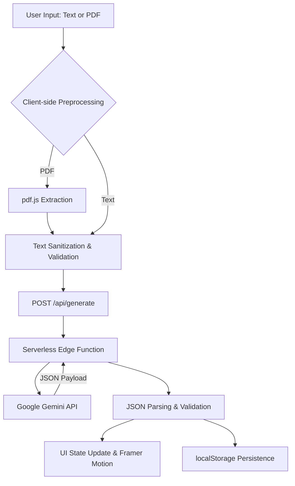

# ExamOracle

> Paste your notes. Own your exam.

ExamOracle is an intelligence engine built for students transitioning away from manual rote memorization. During the current Pilot Phase, ExamOracle utilizes Google's Gemini 2.0 Flash architecture to map concept complexity, recurrence, and structure from raw lecture notes—programmatically predicting the exact questions most likely to appear on an upcoming exam.

---

## The Problem
Students spend over 60% of their exam preparation time formatting study materials (writing flashcards, condensing notes, guessing at potential essay questions) rather than actively learning the material. Existing tools either require manual input of questions and answers, or provide generic, unweighted quizzes that fail to prioritize the highest-yield concepts.

ExamOracle solves this by shifting the paradigm from manual review to programmatic prediction. Rather than asking the student what they want to study, the engine ingests the raw source material and tells the student exactly what they *need* to study.

## Core Features
- **The Exam Oracle**: Analyzes the provided structural document and generates a probability-ranked list (High, Medium, Low) of the exact prompts likely to be tested.
- **Active Recall Engine**: Automatically extracts core definitions and mechanisms into an interactive flashcard deck.
- **Instant Assessment**: Generates a multiple-choice quiz complete with context-aware explanations for incorrect answers to reinforce learning.
- **Extractive Summarization**: Condenses extensive text dumps or long PDFs into dense, skimmable briefs while assigning an overall topic difficulty rating.
- **Local Persistence**: Study kits are saved locally to the browser for immediate retrieval upon return.

---

## Screenshots


---

## Architecture

ExamOracle is built with a highly optimized, fully client-side interface coupled with a serverless edge backend to minimize latency and operational costs during the pilot phase.

### System Flow
1. **Client Layer (Next.js & React)**: The user provides unformatted text or uploads a PDF. 
2. **Preprocessing (PDF.js)**: If a PDF is provided, extraction occurs entirely client-side to spare backend processing overhead. The resulting text is sanitized and counted against the free tier limit.
3. **API Routing (Next.js Serverless)**: Validated text strings are sent via POST request to the secure, backend API route which handles authentication with the LLM provider.
4. **LLM Engine (Gemini 2.0 Flash)**: A heavily engineered system prompt forces the model to return a strict, heavily structured JSON object containing all requisite study assets simultaneously.
5. **State Management**: The returned payload is parsed, displayed via Framer Motion animations in the UI, and committed to `localStorage` for session persistence.



---

## Tech Stack
- **Frontend Framework**: Next.js 14, React 18
- **Styling & Animation**: Tailwind CSS, Framer Motion
- **Backend Infrastructure**: Next.js App Router (Serverless API Routes)
- **AI Core**: Google Gemini API (gemini-2.0-flash)
- **Document Processing**: Mozilla PDF.js
- **Lead Capture / Waitlist**: Formspree API
- **Continuous Integration**: GitHub Actions
- **Deployment Platform**: Vercel

---

## Pilot Phase Notes
This repository currently represents the Pilot Launch candidate. 
- Authentication and persistent database storage are deferred in favor of frictionless `localStorage` adoption to maximize early user testing volume.
- A waitlist mechanism is integrated to validate demand for a future "Pro" tier involving larger context windows (e.g., full textbook ingestion) before investing in Stripe billing infrastructure.

## Local Development Guide

### Prerequisites
- Node.js (v18.x or higher)
- A Google Gemini API Key

### Setup
1. Clone the repository
   ```bash
   git clone https://github.com/yourusername/exam-oracle.git
   cd exam-oracle
   ```

2. Install dependencies
   ```bash
   npm install
   ```

3. Configure Environment Variables
   Create a `.env` file in the root directory and add your API key:
   ```env
   GEMINI_API_KEY=your_gemini_api_key_here
   ```

4. Run the development server
   ```bash
   npm run dev
   ```

5. Access the application at `http://localhost:3000`
