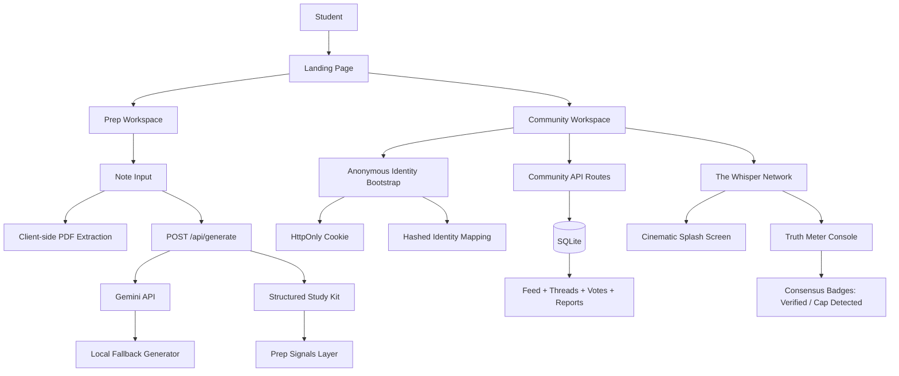
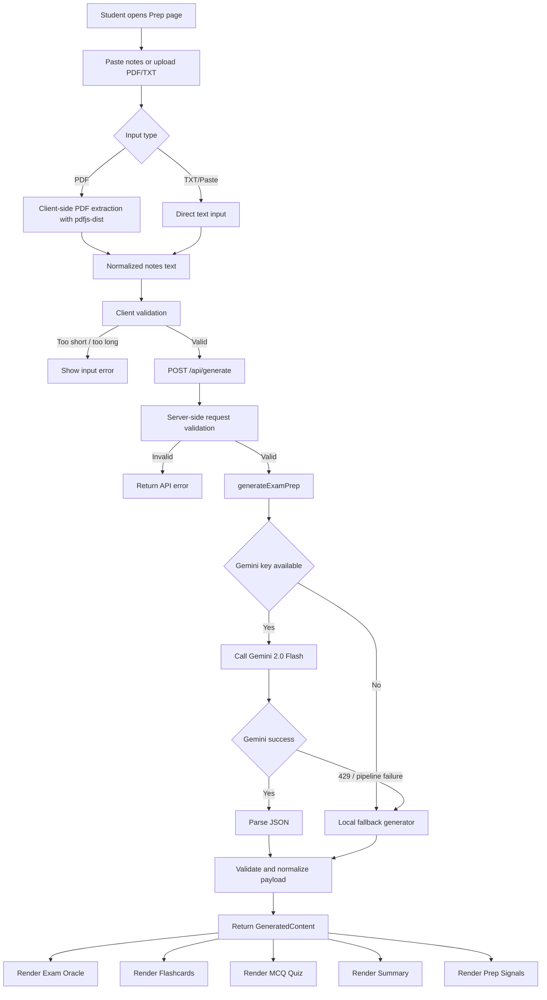
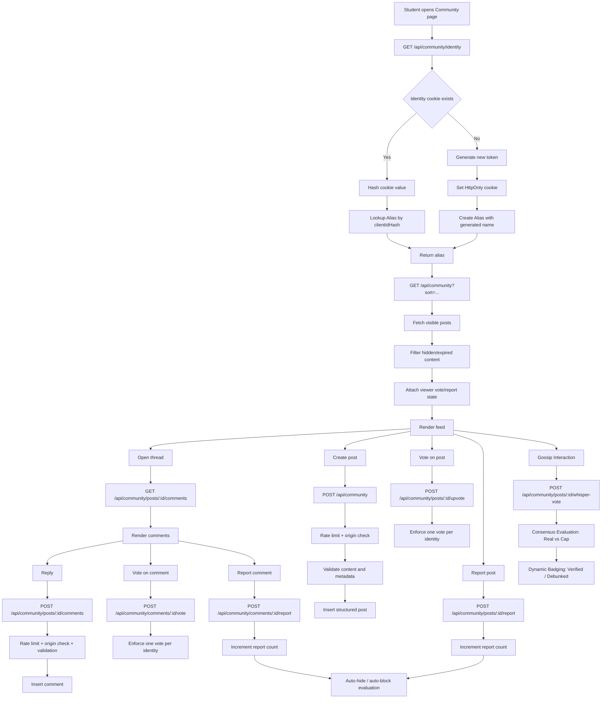

# ExamOracle

ExamOracle is a dual-surface student product built around one core idea: reduce wasted exam-prep effort by turning raw student input into something immediately useful.

The repository currently contains two connected but distinct product areas:

1. `Exam Prep`
   Takes pasted notes or extracted PDF text and converts them into a structured study kit: ranked exam predictions, flashcards, MCQs, and a summary.
2. `Community`
   A local-first, pseudonymous student signal board for warnings, doubts, resources, survival threads, library seat updates, and time-sensitive campus intel.

The prep workflow is the primary product surface. The community workflow is designed as a supporting intelligence layer for student behavior around classes, professors, exams, and revision pressure.

3. `The Whisper Network`
   A clandestine, neon-drenched extension of the community for university secrets, confessions, and internal chitchat. It features a specialized "Truth Meter" voting system and premium animated entry.

## Product Overview

### Exam Prep

The prep engine is designed for students who already have notes but do not know:

- what matters most
- what is likely to be asked
- how to convert notes into revision assets quickly

The system accepts unstructured notes and returns a complete revision kit in one pass:

- `Exam Oracle` predictions
- flashcards
- MCQs
- summary
- difficulty rating
- topic detection
- additional student-facing signals such as `How Cooked Am I?`, `Exam Aura`, `Rank My Notes`, and `Syllabus Gap Scan`

### Community

The community layer is built as a pseudonymous campus signal board, not a public social network clone.

It supports structured post types rather than generic text-only threads:

- `Confession`
- `Warning`
- `Resource`
- `Doubt`
- `Hot Take`
- `Library Live`
- `Survival Thread`
- `Intel Drop`

#### The Whisper Network (Premium Extension)

A dedicated section for high-stakes campus chatter with a distinct "Deep Space" aesthetic:

- **Cinematic Entry**: Animated splash screen with secretive messaging.
- **Truth Meter**: Specialized voting (Real, Cap, idk) replacing standard upvotes.
- **Consensus Badges**: Posts hitting high "Real" scores get a `VERIFIED` shield; high "Cap" scores get a `CAP DETECTED` mask.
- **Gossip Royalty**: Gamified tracking for the "Gossip King/Queen" among the inner circle.


The system keeps identity anonymous at the UI level and pseudonymous at the system level through a server-owned cookie and hashed identifier model.

## Core Features

### Exam Prep Features

- Paste notes or upload PDF/TXT files
- Client-side PDF extraction with PDF.js
- Gemini-backed structured generation with local fallback
- Probability-ranked exam question predictions
- Flashcard generation
- MCQ generation
- Dense summary generation
- Difficulty and topic detection
- Viral/student-facing layers:
  - `How Cooked Am I?`
  - `Exam Aura`
  - `Rank My Notes`
  - `Syllabus Gap Scan`

### Community Features

- Pseudonymous anonymous identity per browser session
- Structured post types with metadata
- Post voting and vote switching
- Comment voting and vote switching
- Reporting for posts and comments
- Automatic hiding and blocking thresholds
- In-memory rate limiting for abusive action bursts
- Same-origin checks on mutating community routes
- Sort modes:
  - `Latest`
  - `Top`
  - `Active`

## Tech Stack

- `Next.js 16`
- `React 19`
- `TypeScript`
- `Tailwind CSS 4`
- `Framer Motion`
- `Prisma 7`
- `SQLite`
- `Google Gemini`
- `better-sqlite3`
- `@prisma/adapter-better-sqlite3`

## Repository Structure

Key areas of the codebase:

- [app/page.tsx](/Users/yashsrivastava32/Desktop/ExamOracle/app/page.tsx)
  Landing page
- [app/prep/page.tsx](/Users/yashsrivastava32/Desktop/ExamOracle/app/prep/page.tsx)
  Main exam-prep workflow
- [app/community/page.tsx](/Users/yashsrivastava32/Desktop/ExamOracle/app/community/page.tsx)
  Main community workflow
- [app/api/generate/route.ts](/Users/yashsrivastava32/Desktop/ExamOracle/app/api/generate/route.ts)
  Exam-prep API route
- [app/api/community/route.ts](/Users/yashsrivastava32/Desktop/ExamOracle/app/api/community/route.ts)
  Community feed and post creation route
- [lib/gemini.ts](/Users/yashsrivastava32/Desktop/ExamOracle/lib/gemini.ts)
  Gemini generation and local fallback logic
- [lib/community.ts](/Users/yashsrivastava32/Desktop/ExamOracle/lib/community.ts)
  Community business logic
- [lib/communityIdentity.ts](/Users/yashsrivastava32/Desktop/ExamOracle/lib/communityIdentity.ts)
  Anonymous identity logic
- [lib/communitySecurity.ts](/Users/yashsrivastava32/Desktop/ExamOracle/lib/communitySecurity.ts)
  Rate limiting and request-origin checks
- [lib/prepSignals.mjs](/Users/yashsrivastava32/Desktop/ExamOracle/lib/prepSignals.mjs)
  Extra prep-side heuristics and student-facing signals
- [prisma/schema.prisma](/Users/yashsrivastava32/Desktop/ExamOracle/prisma/schema.prisma)
  Prisma schema

## Architecture

### High-Level System View



## Exam Prep Workflow

### Summary

The prep system is designed to convert one large, messy student input into one high-value output package.

The user experience is intentionally compressed:

1. paste or upload notes
2. submit once
3. receive a complete study kit
4. explore specific views only after the full kit exists

### Detailed Workflow



### Exam Prep Data Contract

The prep engine returns this structured shape:

```ts
{
  examOracle: Array<{
    question: string;
    probability: "high" | "medium" | "low";
    topic: string;
    type: "Written" | "MCQ" | "Short Answer" | "Compare" | "Explain" | "Define";
    difficulty: "Easy" | "Medium" | "Hard";
  }>;
  flashcards: Array<{
    front: string;
    back: string;
  }>;
  mcqQuestions: Array<{
    question: string;
    options: [string, string, string, string];
    answer: string;
    explanation: string;
  }>;
  summary: string;
  difficultyRating: "Easy" | "Medium" | "Hard";
  topicName: string;
}
```

### Exam Prep Rendering Layers

The returned study kit is rendered into multiple product views:

- `Exam Oracle`
  Probability-ranked predicted questions
- `Flashcards`
  Quick active-recall deck
- `Quiz`
  Short MCQ practice set
- `Summary`
  Dense revision brief
- `Prep Signals`
  Student-attraction / viral / framing layer:
  - cooked score
  - aura card
  - notes rank
  - syllabus gap scan

## Community Workflow

### Summary

The community is designed to simulate Reddit-like persistence without exposing real identity in this phase.

The important distinction:

- it is not anonymous cryptography
- it is pseudonymous identity with system-owned state

That means:

- the browser gets a stable anonymous identity cookie
- the database stores only a hashed identifier and generated alias
- the UI never shows the hashed identifier

### Detailed Workflow



### Community Post Types

The database stores structured signal types rather than generic flat content.

Supported modes:

- `confession`
- `warning`
- `resource`
- `doubt`
- `hot_take`
- `library_live`
- `survival_thread`
- `intel_drop`

Additional metadata fields vary by signal type:

- `subjectTag`
- `locationHint`
- `quietLevel`
- `hotTakeScore`
- `expiresAt`
- `isPinned`

### Community Moderation Model

Current moderation behavior is rule-based and local-first:

- one identity can report a post only once
- one identity can report a comment only once
- repeated reports can auto-hide content
- repeated author-level report totals can auto-block the identity
- mutating routes apply in-memory rate limiting
- mutating routes reject cross-origin requests

This is enough for local iteration and early hosted testing, but not a final public moderation system.

## Database Schema Overview

Main data models:

- `Alias`
  Pseudonymous identity record
- `Post`
  Structured community post
- `Comment`
  Thread replies
- `PostVote`
  One vote per alias per post
- `CommentVote`
  One vote per alias per comment
- `PostReport`
  One report per alias per post
- `CommentReport`
  One report per alias per comment

## Local Development

### Prerequisites

- Node.js 20+
- npm
- Gemini API key if you want live generation

### Environment Variables

Create a `.env` file:

```env
GEMINI_API_KEY=your_gemini_api_key_here
DATABASE_URL="file:./dev.db"
COMMUNITY_IDENTITY_SECRET=replace_this_for_real_deployments
```

Notes:

- `GEMINI_API_KEY`
  Enables live Gemini generation.
- `DATABASE_URL`
  Points Prisma to the local SQLite database.
- `COMMUNITY_IDENTITY_SECRET`
  Used to hash community identity cookies. If omitted, the app falls back to a development default. That fallback is acceptable for local work, but not for real deployment.

### Install

```bash
npm install
```

### Sync Prisma Schema

```bash
npx prisma generate
npx prisma db push
```

### Run Development Server

```bash
npm run dev
```

### Seed Community Data

To flood the local board with realistic Indian-campus-style sample content:

```bash
node scripts/seed-community.mjs
```

### Verification Commands

```bash
npm test
npm run lint
npx next build --webpack
```

## CI Workflow

The repository now includes a GitHub Actions CI pipeline in [.github/workflows/ci.yml](/Users/yashsrivastava32/Desktop/ExamOracle/.github/workflows/ci.yml).

It runs:

- dependency installation
- Prisma client generation
- schema sync
- tests
- lint
- production build

## Runtime Notes

### Gemini Behavior

If Gemini is available and quota is valid:

- the prep route uses the live model

If Gemini is missing, errors, or returns quota exhaustion:

- the prep route falls back to the local generator

This means the prep system still returns a valid study kit even when the external model is unavailable.

### Anonymous Identity Model

The community uses pseudonymous identity, not end-to-end encryption.

The current model is:

- browser receives anonymous session cookie
- server hashes the cookie value
- hashed identifier maps to generated alias
- public surfaces show alias only
- posts/comments/votes/reports all bind to that alias identity

If a student clears cookies:

- a new identity is created
- a new alias is assigned

